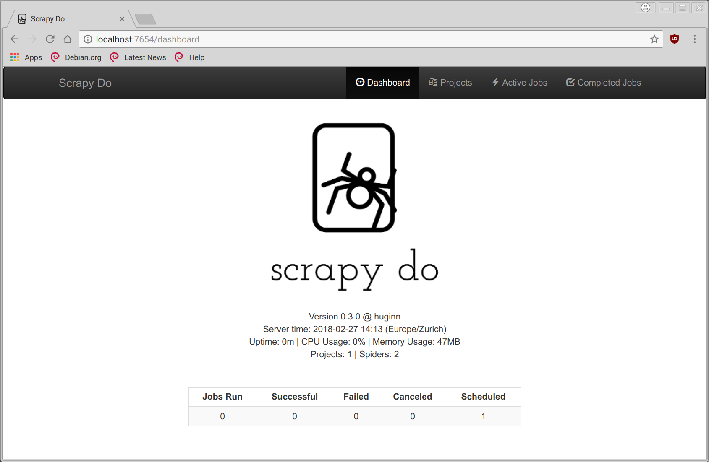
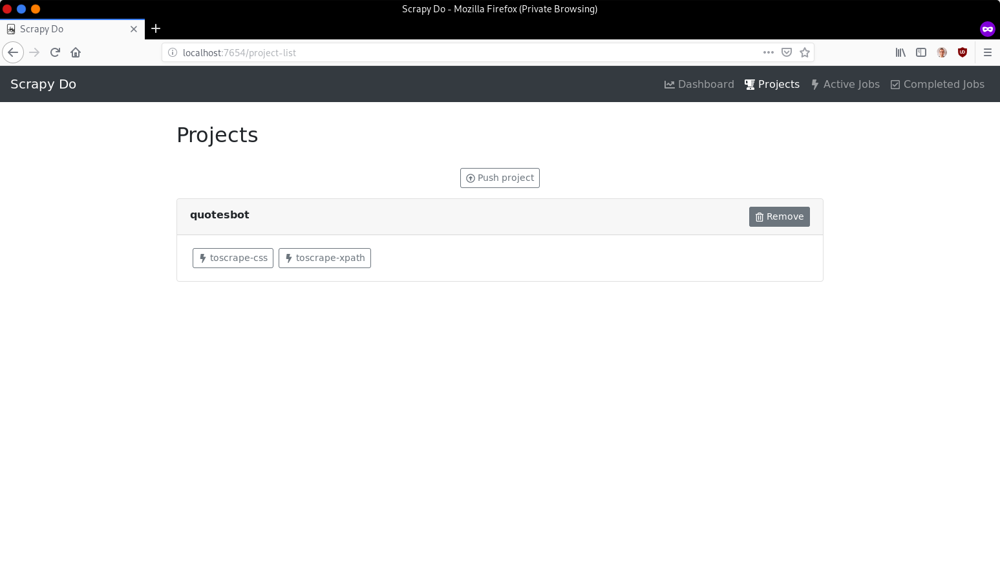
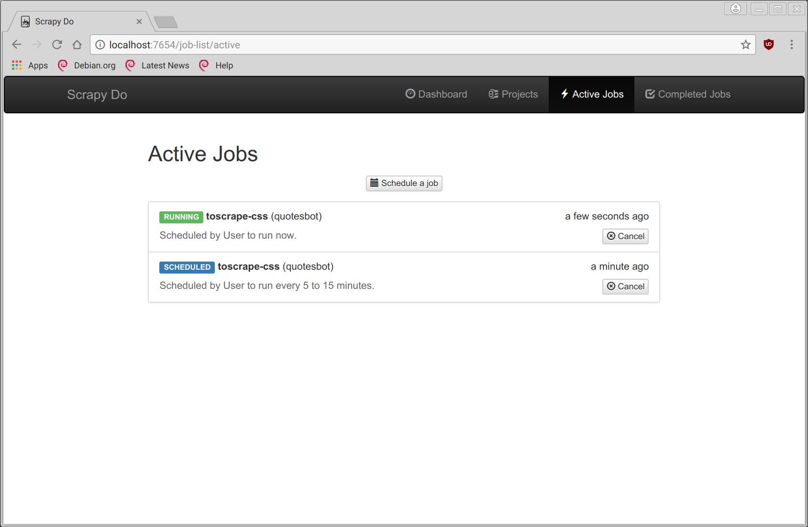
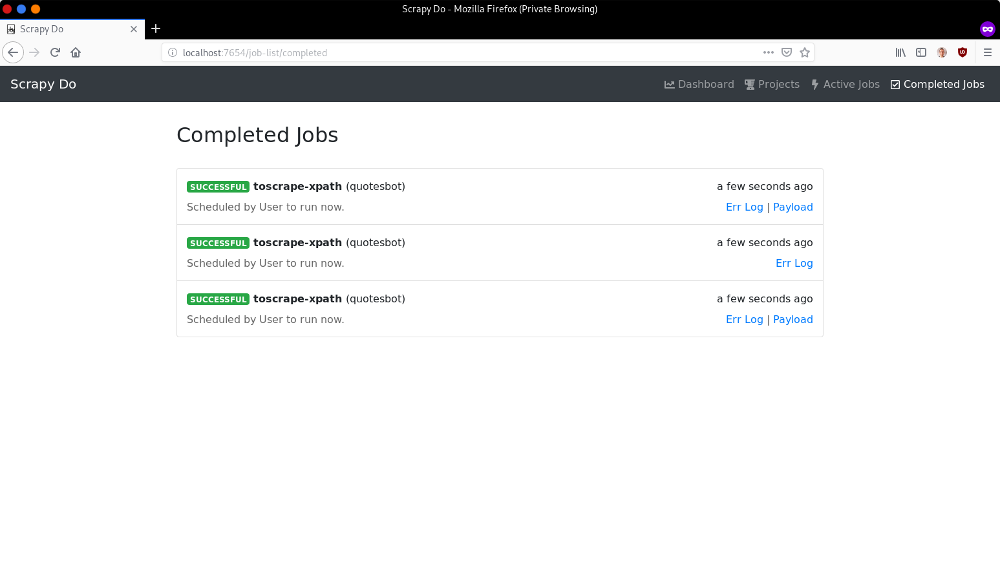

=======
Web GUI
=======

Scrapy Do comes with a simple web user interface that provides the functionality
equivalent to that of the commandline client or the REST API.

   The dashboard shows the status of the running daemon and some of the job
   statistics.

   The project’s view lists all the projects and the spiders they provide. You
   can push new projects or schedule jobs for the existing spiders.

   The active job view lists all the jobs that are either scheduled, pending, or
   running.

   The completed jobs view lists all the jobs that have been completed and their
   logs if available.
